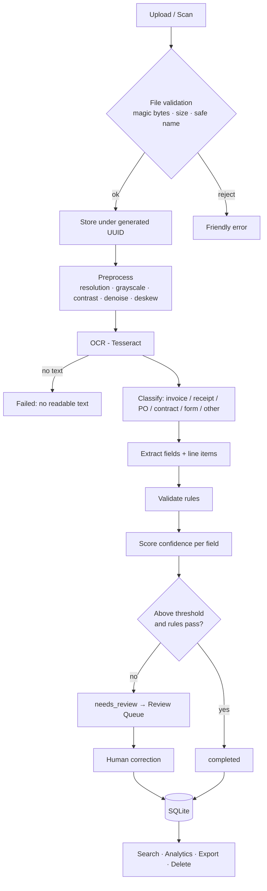

# SecureDoc AI

> **Private document intelligence. Powered locally.**
>
> Turn documents into structured data — without sending them to the cloud.

SecureDoc AI is a privacy-first, offline document intelligence platform. It
accepts PDFs, images and camera scans, preprocesses them, runs OCR **on this
device**, classifies the document, extracts structured fields with confidence
scores, validates the arithmetic, and lets a human correct anything before it
is stored in a local SQLite database — ready for search, analytics and export.

**No API keys. No cloud calls. No telemetry.** The entire MVP works with the
internet unplugged.

---

## Table of contents

1. [Product overview](#1-product-overview)
2. [Screenshots](#2-screenshots)
3. [Features](#3-features)
4. [Architecture](#4-architecture)
5. [AI pipeline](#5-ai-pipeline)
6. [Privacy model](#6-privacy-model)
7. [Installation](#7-installation)
8. [Local development](#8-local-development)
9. [Model setup](#9-model-setup)
10. [Snapdragon deployment](#10-snapdragon-deployment)
11. [Benchmarking](#11-benchmarking)
12. [API documentation](#12-api-documentation)
13. [Security](#13-security)
14. [Testing](#14-testing)
15. [Roadmap](#15-roadmap)
16. [License](#16-license)

---

## 1. Product overview

**Primary users:** small businesses, accountants, CA offices, procurement and
legal teams, freelancers, and anyone handling sensitive documents.

**MVP focus:** invoices + receipts, architected so purchase orders, contracts
and forms slot in without rework.

**Core workflow**

```text
Upload / Scan → File validation → Preprocessing → OCR → Classification
    → Field extraction → Confidence scoring → Validation → Human review
    → Local database → Search / Analytics / Export
```

**The central promise:** your documents stay on your device, and AI extracts
the information locally.

---

## 2. Screenshots

> Run the app locally (see [Installation](#7-installation)) to capture
> screenshots of your own data — demo documents are clearly synthetic.

| Screen | What to look for |
|---|---|
| **Dashboard** | KPIs computed from SQLite, document distribution, activity chart, review queue |
| **Scan & Upload** | Drag-and-drop with live per-stage pipeline status |
| **Document workspace** | Split view: preview ⇄ extracted fields with confidence bars and validation |
| **Review Queue** | Filter chips (low confidence, missing fields, validation errors) and side-by-side corrections |
| **Analytics** | Documents over time, categories, invoice value, confidence distribution, review rate |
| **Security Center** | Status checklist, storage breakdown, functional privacy toggles, audit log |

---

## 3. Features

- **Real pipeline, not a mock:** Tesseract OCR, heuristic + ONNX-slot
  classification, hybrid regex/document-aware extraction, deterministic validation.
- **Every field carries a confidence score** — `0.30×OCR + 0.30×Model +
  0.20×Pattern + 0.20×Validation`, weights configurable in Settings.
- **Human review** with original-vs-corrected values persisted to SQLite.
- **Validation engine:** `subtotal + tax − discount ≈ total`, GSTIN structure,
  date ordering, tax-rate plausibility, required fields, line-item sums.
- **Search & filters:** filename, type, vendor, invoice number, GSTIN, amount
  range, date range, confidence, needs-review.
- **Analytics** computed from the local database only.
- **Exports:** JSON, CSV, XLSX (multi-sheet), PDF report — all generated locally.
- **Security Center** with working privacy toggles and an audit log that never
  stores document contents.
- **Offline mode** with a visible `● LOCAL PROCESSING` indicator.
- **Demo mode:** generates clearly synthetic PDFs and runs them through the
  exact same pipeline.

---

## 4. Architecture

```mermaid
flowchart LR
    subgraph Frontend["Frontend — React + TypeScript + Vite"]
        UI[Pages / Components] --> TQ[TanStack Query]
        TQ -->|poll status| PX[Vite proxy /api]
    end

    subgraph Backend["Backend — FastAPI + SQLAlchemy + SQLite"]
        PX --> API[API routers]
        API --> P[Pipeline orchestrator]
        P --> PRE[Preprocessor<br/>PDF render · denoise · deskew · threshold]
        PRE --> OCR[OCRProvider<br/>Tesseract]
        OCR --> CLS[DocumentClassifier<br/>heuristic + ONNX slot]
        CLS --> EXT[DocumentExtractor<br/>regex + document-aware rules]
        EXT --> VAL[Validator]
        VAL --> CFG[Confidence scorer]
        CFG --> DB[(SQLite<br/>data/securedoc.db)]
    end

    DB --> S[Search / Analytics / Exports]
```





**Repository layout**

```text
securedoc-ai/
├── frontend/          React + TS + Vite + Tailwind + shadcn-style UI
├── backend/           FastAPI app (api/ · services/ · models/ · schemas/ · security/)
├── models/            Optional ONNX models + registry README
├── data/              documents/ · processed/ · exports/ · securedoc.db
├── scripts/           install.sh · preview.sh · dev.sh · setup.py · benchmark.py
├── docker/            Dockerfile.backend · Dockerfile.frontend · nginx.conf
├── docker-compose.yml
├── env.example        Non-secret configuration template (copy to .env if desired)
└── README.md
```

---

## 5. AI pipeline

| Stage | Implementation | Fallback |
|---|---|---|
| Preprocessing | PyMuPDF page rendering + Pillow (grayscale, autocontrast, median denoise, projection-profile deskew) + numpy adaptive threshold | fails with a friendly error |
| OCR | `OCRProvider` abstraction → `TesseractProvider` (pytesseract, word boxes + confidence) | `StaticOCRProvider` for tests; friendly error if the binary is missing |
| Classification | `DocumentClassifier` abstraction → `HeuristicClassifier` (keyword + structural scoring, separation-based confidence) | ONNX slot auto-activates when `models/classifier/model.onnx` exists |
| Extraction | Layer 1: regex (dates, currency, GSTIN, invoice numbers, e-mail, phone). Layer 2: document-aware label/value parsing + table-aware line items. Layer 3: validation feedback | generic extractor for unknown types |
| Confidence | `score_field()` weighted blend, renormalized over available components | deterministic defaults |
| Validation | arithmetic, GSTIN shape, date order/parse, required fields, tax-rate plausibility, line-item sums | always returns rule results (never throws) |

Model registry status is visible in **Settings → Installed models** and via
`GET /api/models`. Missing models report *"Unavailable — using deterministic
local fallback"* instead of pretending to run.

---

## 6. Privacy model

- **Local-only processing:** upload, OCR, classification, extraction,
  validation, search, analytics and export all execute inside this app.
- **No silent uploads:** `cloud_processing`, `telemetry` and
  `anonymous_analytics` default to `false`; enabling them requires an explicit
  consent confirmation (and the API rejects `cloud_processing: true` without
  `consent: true`).
- **No sensitive logging:** audit entries record *action names* and counts
  (e.g. `field_edited — 1 field(s)`), never OCR text or field values.
- **Generated storage names:** files are stored as `data/documents/<uuid>.<ext>`;
  the original filename is metadata only.
- **Permanent deletion:** `DELETE /api/documents/{id}` removes the file,
  processed pages, OCR text, extracted fields and review history (cascading),
  and writes an audit entry.
- **Offline indicator:** `● LOCAL PROCESSING` is always visible; going offline
  shows *"Offline mode active — all document processing continues locally."*
- **Audit log:** import, OCR, classification, extraction, validation, edits,
  exports, deletions, settings and privacy changes.

---

## 7. Installation

Prerequisites: Python 3.10+, Node 18+, Tesseract OCR.

```bash
# 1) Tesseract (required for OCR)
#    Ubuntu/Debian
sudo apt-get install -y tesseract-ocr tesseract-ocr-eng
#    macOS
brew install tesseract

# 2) Everything else (frontend + backend + venv)
sh ./scripts/install.sh
```

Manual equivalent:

```bash
# Backend
python3 -m venv .venv

# Windows
.venv\Scripts\activate
# Linux/macOS
source .venv/bin/activate

pip install -r backend/requirements.txt

# Frontend
cd frontend
npm install
cd ..
```

Configuration lives in environment variables — see [`env.example`](env.example)
(copy it to `.env` if you want overrides). **No API keys are required.**

---

## 8. Local development

One command (backend + frontend together):

```bash
sh ./scripts/dev.sh
```

Or in two terminals:

```bash
# Terminal 1 — backend
source .venv/bin/activate
uvicorn app.main:app --app-dir backend --reload

# Terminal 2 — frontend
cd frontend
npm run dev
```

Open <http://localhost:5173> — the Vite dev server proxies `/api` to the
FastAPI service on port 8000.

Other useful commands:

```bash
# Initialize / repair the local database and folders
.venv/bin/python scripts/setup.py

# Generate synthetic demo documents (clearly marked, never real data)
curl -X POST http://localhost:8000/api/documents/demo

# Production frontend build (emits ./dist)
npm --prefix frontend run build
```

### Docker

```bash
docker compose up --build
# frontend → http://localhost:8080  ·  backend → http://localhost:8000
```

> Native (non-Docker) runs keep direct CPU/NPU access, which is what you want
> for Snapdragon deployment.

---

## 9. Model setup

Everything works without model files. To upgrade the classifier:

```bash
.venv/bin/python scripts/download_models.py                 # registry status
.venv/bin/python scripts/download_models.py \
    --install my_model.onnx my_vocab.json                    # install locally
```

Layout and contract details: [`models/README.md`](models/README.md).

OCR language packs: install additional Tesseract languages (e.g.
`tesseract-ocr-hin`) and select the language under **Settings → Processing**.

---

## 10. Snapdragon deployment

The pipeline is designed so the CPU-bound stages can be swapped for
Snapdragon/Hexagon acceleration **without touching orchestration code**:

1. **ONNX Runtime + QNN EP.** The classifier already loads through
   `onnxruntime`. On a Snapdragon device, build/install ONNX Runtime with the
   QNN execution provider and the same `model.onnx` (quantized to INT8) runs on
   the NPU instead of the CPU — no code change beyond provider selection.
2. **OCR.** `OCRProvider` is a three-method interface; a QNN/OCR SDK-backed
   implementation registers exactly like `TesseractProvider`.
3. **Batch-size control.** `Preprocessor(max_dimension=...)` bounds image size,
   and `Settings.max_file_size_mb` bounds input — both already runtime
   configurable.
4. **Benchmark before/after** with `scripts/benchmark.py` on-device.

> This environment has no Qualcomm hardware, so **no NPU metrics are claimed
> anywhere in this project.** The benchmark prints measured CPU numbers only.

---

## 11. Benchmarking

```bash
.venv/bin/python scripts/benchmark.py                     # synthetic demo invoice
.venv/bin/python scripts/benchmark.py path/to/invoice.pdf # your document
```

Example output shape (values measured at runtime on your machine):

```text
SECUREDOC AI BENCHMARK
----------------------------------------------
Document:        demo_invoice_01.pdf (synthetic demo)
OCR engine:      tesseract
Classifier:      heuristic (invoice, 0.99)
----------------------------------------------
Preprocessing:     ... ms
OCR:               ... ms
Classification:    ... ms
Extraction:        ... ms
Validation:        ... ms
----------------------------------------------
Total:             ... ms
Memory (peak):     ... MB
```

---

## 12. API documentation

FastAPI serves interactive OpenAPI docs at **<http://localhost:8000/docs>**
(and `/redoc`).

| Method | Path | Purpose |
|---|---|---|
| `POST` | `/api/documents/upload` | Validate + store a file locally |
| `GET` | `/api/documents` | List with filters |
| `GET` | `/api/documents/{id}` | Full detail (fields, validations, OCR) |
| `GET` | `/api/documents/{id}/status` | Lightweight polling target |
| `POST` | `/api/documents/{id}/process` | Queue the pipeline |
| `POST` | `/api/documents/{id}/review` | Persist human corrections |
| `DELETE` | `/api/documents/{id}` | Permanent local deletion |
| `POST` | `/api/documents/demo` | Generate synthetic demo documents |
| `GET` | `/api/search` | Full-text search + filters |
| `GET` | `/api/analytics` | Database-derived metrics |
| `GET` | `/api/export/{id}/{json\|csv\|xlsx\|pdf}` | Local exports |
| `GET`/`PUT` | `/api/settings` | Settings (consent gate for cloud) |
| `GET` | `/api/security/status` | Privacy status + storage |
| `GET` | `/api/audit-logs` | Action-level audit trail |
| `GET` | `/api/models` | Model registry status |

Processing states: `uploaded → queued → preprocessing → ocr → classifying →
extracting → validating → completed | needs_review | failed`. The executor is a
FastAPI background task behind `Pipeline.run(document_id)` so Celery/RQ can be
swapped in later without changing the pipeline.

---

## 13. Security

- **Never trust filenames:** path components, control characters and
  shell-hostile characters are stripped; storage paths are generated UUIDs.
- **Magic-byte type checks** — a renamed `.exe` never passes as a PDF.
- **Size limits** enforced server-side (`MAX_UPLOAD_MB`), friendly 413s.
- **Parameterized SQL only** (SQLAlchemy ORM); search terms are bound values,
  and injection attempts return zero results instead of errors.
- **Pydantic validation** on every input; friendly 422s, never stack traces.
- **Path containment:** file deletion, page images and exports resolve inside
  their allowed directories.
- **Sanitized export filenames:** `securedoc_<type>_<id8>.<ext>`.
- **No sensitive logs:** OCR text and field values never reach application logs.
- **Temporary cleanup:** processed page images are removed with the document.

---

## 14. Testing

```bash
# Backend (pytest) — OCR abstraction, classification, extraction, validation,
# confidence, database, API, exports, security, end-to-end pipeline
cd backend && ../.venv/bin/python -m pytest

# Frontend (Vitest + Testing Library) — upload, document list, viewer,
# review form, dashboard, search
npm --prefix frontend test

# Type check
npm --prefix frontend run typecheck
```

Edge cases covered: missing invoice number, wrong total, poor OCR (blank
document), rotated document, multi-page PDF, oversized images, traversal
filenames, extension spoofing, SQL injection attempts, oversized uploads,
consent-gated settings.

---

## 15. Roadmap

- Dedicated contract / purchase-order / form extractors (registry is ready).
- Field bounding-box highlighting on the preview (OCR boxes already stored).
- FTS5 virtual table for OCR full-text search.
- Celery/RQ executor behind the existing `Pipeline.run` interface.
- Quantized ONNX classifier + Snapdragon QNN deployment guide with on-device
  benchmark numbers.
- Optional, consent-gated external enrichment (disabled by default forever
  unless explicitly enabled).

---

## 16. License

MIT — see [LICENSE](LICENSE).
